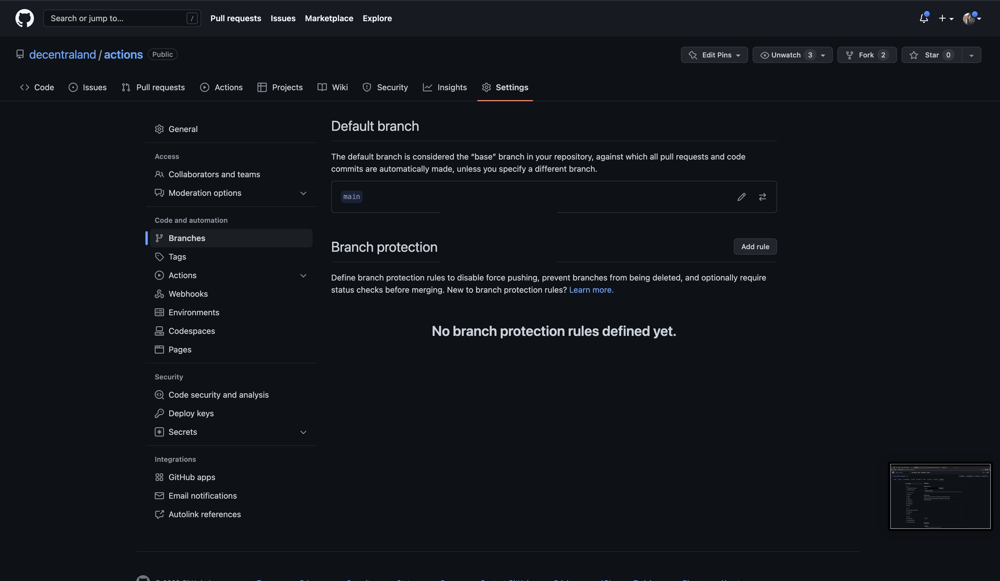
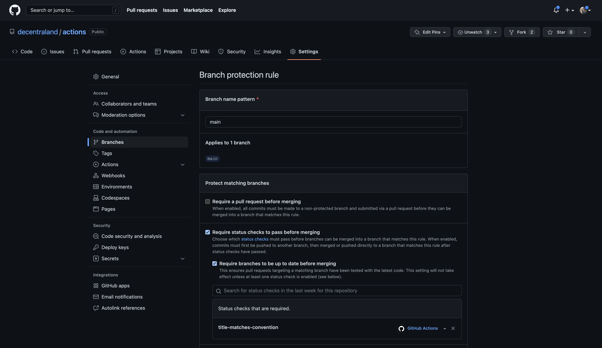

Once you have pushed the `validate-pr-title` workflow to a branch you should make the validation a required check for your prs:

1. Go to your repo `Settings` -> `Branches`
    
    

2. Click on `Add a rule` (or edit an existing one)
3. Fill the `Branch name pattern` input to match a branch (tipically `main`)
4. Check on `Require status checks to pass before merging`
5. Check on `Require branches to be up to date before merging` (optional)
6. Type into the search box for `title-matches-convention` and add it

    

7. Click on the `Create` button at the bottom of the page and you are done