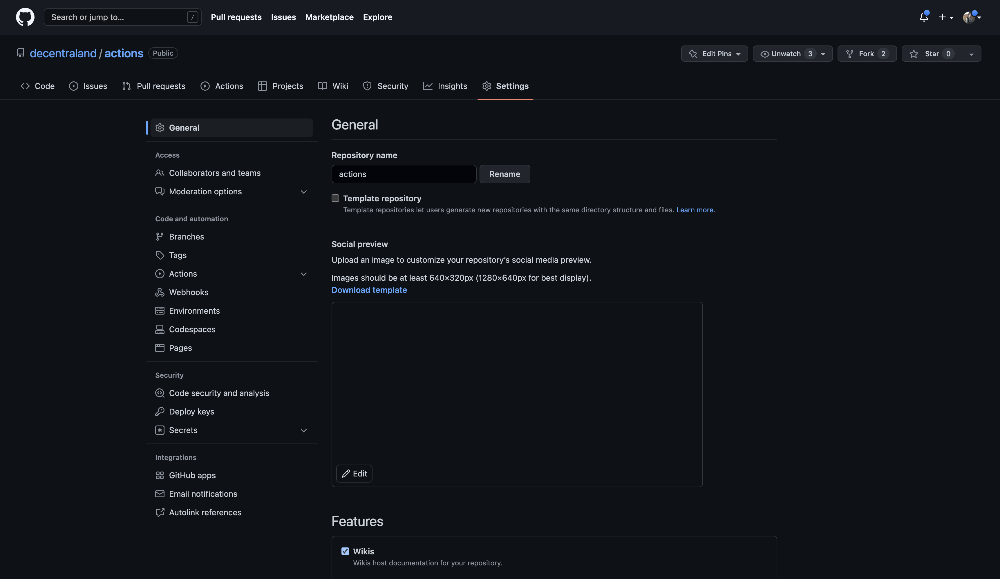
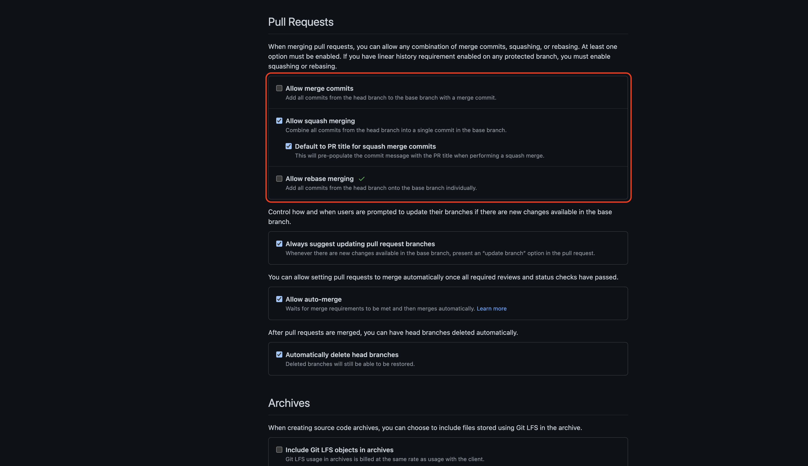

1. Go to `Settings` -> `General`
    
    

2. Go to the `Pull Requests` section
   1. Uncheck `Allow merge commits ` 
   2. Check on `Allow squash merging `
   3. Check on `Default to PR title for squash merge commits `
   4. Uncheck `Allow rebase merging`

    
